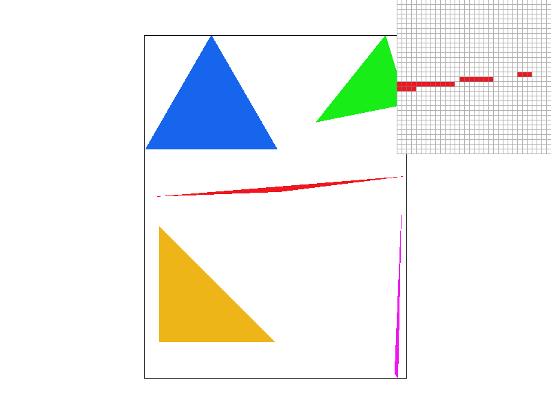
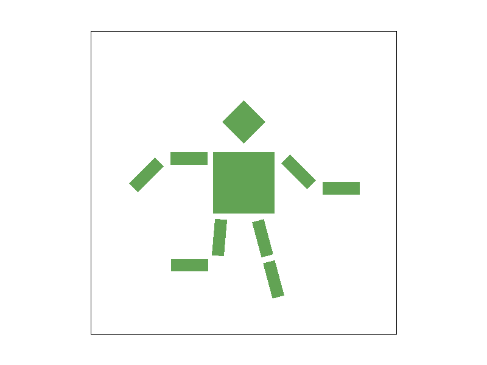
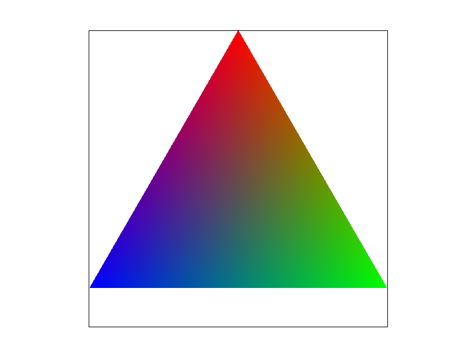
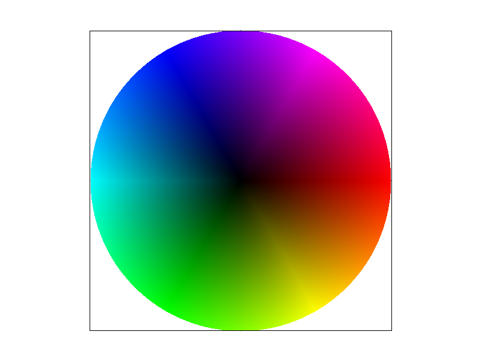
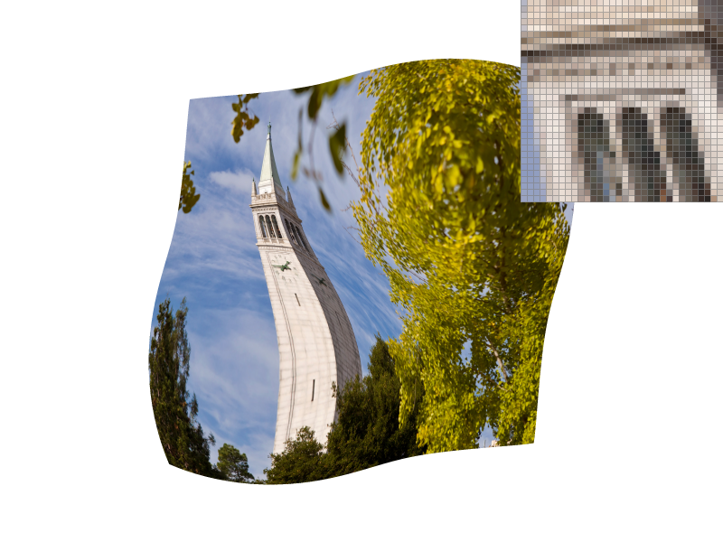
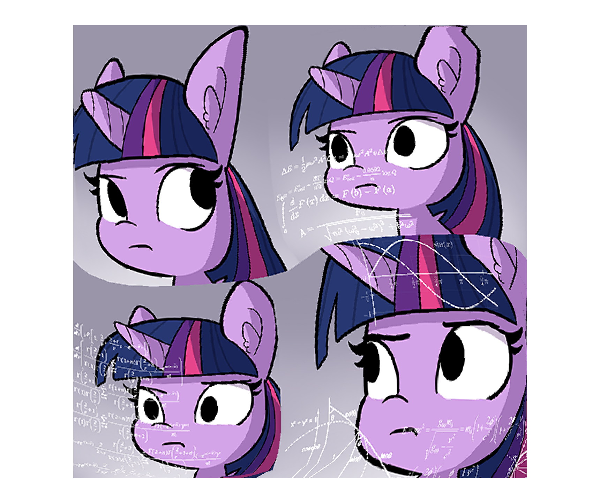

# Report on CS 184 Project 1: Rasterizer
## Overview
This project aims to implement a functional vector graphics renderer supporting a limited subset of SVG standard. This is a software render, and is (mostly) single-threaded, so significant performance issues are anticipated. 
## Task 1: Rasterizing single-colored triangles
- Walk through how you rasterize triangles in your own words 
  The first step is to frame up a block surrounding the triangle as its bounding box, discarding those pixels that for sure will not form the triangle. The triangle bounding box is defined as a box which has a diagonal of `(min_x, min_y)` and `(max_x, max_y)`. Then we need to check every pixel in the bounding box and retain pixels within the triangle. In general, for the three edges of the triangle, if `(sample_pt_coord - normal_vec_root_coord) * normal_vec` on every edge shares the same sign (because the winding direction of vertices is unknown), the sample point is in the triangle. Finally, the pixels in the triangle are painted onto the render buffer. 
- Explain how your algorithm is no worse than one that checks each sample within the bounding box of the triangle. 
  The triangle test algorithm used is equivalent to checking each sample within bounding box. 
- Show a png screenshot of `basic/test4.svg` with the default viewing parameters and with the pixel inspector centered on an interesting part of the scene. 
   
  Notice that without any anti-aliasing, the narrow part of red triangle shows some typical visual aliasing artifacts. 
- Performance optimization on triangle test 
  After adding some OpenMP directives to parallelize the for loops, there's some evident gain of performance. For example, during the test run on `test4.svg`: 
    | Scenario | Frame Time (s) (using `std::chrono::steady_clock`) | Diff% | 
    | - | - | - |
    | With multi-threading | 0.000985 | -20.8% | 
    | Without multi-threading | 0.001243 | 0% | 

## Task 2: Supersample anti-aliasing
- Walk through your supersampling algorithm and data structures. Why is supersampling useful? What modifications did you make to the rasterization pipeline in the process? Explain how you used supersampling to antialias your triangles. 
  Supersampling provides us a way to subdivide a pixel and integrate the result into a transient pixel, which has the effect of low-pass filtering, thus reducing aliasing. 
  The intermediate render buffer is upscaled with the supersampling factor (in terms of area), and the triangles, the bounding box, and other elements are also scaled accordingly. Finally, after drawing the upscaled version of the image to the supersample buffer, the image is downsampled to the screen buffer for display. 
- Show png screenshots of `basic/test4.svg` with the default viewing parameters and sample rates 1, 4, and 16 to compare them side-by-side. Position the pixel inspector over an area that showcases the effect dramatically; for example, a very skinny triangle corner. Explain why these results are observed. 
    | x1 | x4 | x16 | 
    | - | - | - |
    |  |  |  | 
A higher supersample scaling means better approximation of the block pixel filter, thus reducing the aliasing effect in the resulting image. 
## Task 3: Transform
- Create an updated version of `svg/transforms/robot.svg` with cubeman doing something more interesting, like waving or running. Explain what you were trying to do with cubeman in words. 
  The modified vector graphic is as follows: 
   
  The render result is: 
   
  To model a running robot, every block of its limbs is rotated and moved differently. Its right inner arm was rotated anticlockwise 45 deg and pushed outward while the right outer arm maintains level, and its left arm was rotated clockwise 90 deg as a whole, then the left outer arm was rotated 45 deg anticlockwise to form the upper body posture. Similar adjustments were made to its legs.  
## Task 4: Barycentric coordinates
- Explain barycentric coordinates in your own words and use an image to aid you in your explanation. 
  Barycentric coordinate is a coordinate system in relation to a triangle that defines relative position of a point in triangle. In this case, barycentric coordinate is used to interpolate color of a specific point in triangle using the color of three vertices. Typically, barycentric coordinate could be interpreted as a triplet that encodes the deviation from one of the vertices. For instance, in $\triangle ABC$, a sample point can be represented as $P = (α, β, γ), α+β+γ=1$. Then we can get $P=αA+βB+γC$. For our usage, however, barycentric coordinate is used to calculate the sample point color as the weighted component sum of the color of three vertices. 
   
  For instance, in the example above, smooth color transition between red, green and blue is made possible using barycentric coordinates. 
- Show a png screenshot of `svg/basic/test7.svg` with default viewing parameters and sample rate 1. 
  
## Task 5: Various texture pixel sampling methods
- Explain pixel sampling in your own words and describe how you implemented it to perform texture mapping. Briefly discuss the two different pixel sampling methods, nearest and bilinear. 
  Pixel sampling means mapping an underlying source "texture" to the color presented in the rendered image. Nearest sampling determines the barycentric coordinate of the sampling pixel in target texture, then takes the nearest texel value as the final value representing that pixel. Bilinear sampling, on the other hand, takes the nearest four texels on the grid and calculate a weighted average as the final result. In my implementation, function [`Texture::sample_nearest`](https://github.com/cal-cs184-student/p1-rasterizer-sp22-obfuscated/blob/master/src/texture.cpp#L30) and [`Texture::sample_bilinear`](https://github.com/cal-cs184-student/p1-rasterizer-sp22-obfuscated/blob/master/src/texture.cpp#L36) provides the actual sampling results using a texture coordinate $(u, v)$ and the target mipmap level. In the case on nearest sampling, $(u, v)$ is converted to the rounded (nearest) coordinate in the mipmap level used, and the corresponding color is returned. In comparison, bilinear sampling takes the floor and ceiling of the mipmap coordinate to get four nearest texels, and return the weighted (distance as weight) average color as result. (Note that linear interpolation is used in bilinear sampling)
- Check out the svg files in the `svg/texmap/` directory. Use the pixel inspector to find a good example of where bilinear sampling clearly defeats nearest sampling. Show and compare four png screenshots using nearest sampling at 1 sample per pixel, nearest sampling at 16 samples per pixel, bilinear sampling at 1 sample per pixel, and bilinear sampling at 16 samples per pixel. (In the order described) 

 
  |  |  |
  | - | - |
  |  |  |
- Comment on the relative differences. Discuss when there will be a large difference between the two methods and why. 
  As seen above, because bilinear sampling provides a continuous mapping of texture coordinates to colors, it appears smoother than nearest neighbor. The visual difference (nearest vs. bilinear) is most significant between two [1x examples](#anchor-texmap). Object boundaries are clearly less noisy with bilinear sampling. Those differences are mainly caused by dense details (high frequency signal) packed in this specific area of image, which is most prone to aliasing artifacts, so bilinear helps to filer out abrupt changes and smooth the artifacts out. Similar phenomenon is also present in [16x examples](#anchor-texmap), albeit less visually pronounced. (Plain supersampling can still be effective.)
## Task 6: Mipmap & Level texture sampling
- Explain level sampling in your own words and describe how you implemented it for texture mapping. 
  Using one generic texture map for a variable density image poses several issues. One of them is that the texture resolution might not be a good fit to the target display resolution, which can lead to visual artifacts. However, by storing multiple versions of texture at different resolutions, various mipmap level sampling techniques can choose from them based on extracted depth information and generate a interpolated result. In my implementation, three types of mipmap sampling are available: `level zero`/`nearest`/`bilinear`. Level zero just uses `mipmap[0]`, nearest will use the closest level to the calculated best, and bilinear will interpolate between the two closest levels. The ideal level is calculated with: $D=\log_2{max(\sqrt{\frac{du^2}{dx} + \frac{dv^2}{dx}}, \sqrt{\frac{du^2}{dy} + \frac{dv^2}{dy}})}$. The driver code [`Texture::sample`](https://github.com/cal-cs184-student/p1-rasterizer-sp22-obfuscated/blob/master/src/texture.cpp#L9) gets the populated `SampleParams` from [`RasterizerImp::rasterize_textured_triangle`](https://github.com/cal-cs184-student/p1-rasterizer-sp22-obfuscated/blob/master/src/rasterizer.cpp) and extract the sample texture coordinate, the derivatives needed for level calculation, and requested pixel/level sampling mode. The ideal level is calculated with [`Texture::get_level`](https://github.com/cal-cs184-student/p1-rasterizer-sp22-obfuscated/blob/master/src/texture.cpp#L22) and dispatched to corresponding sampling functions. 
- You can now adjust your sampling technique by selecting pixel sampling, level sampling, or the number of samples per pixel. Describe the tradeoffs between speed, memory usage, and antialiasing power between the three various techniques. 
  Speed: One pixel per sample is fastest. In pixel sampling, nearest neighbor is faster than bilinear, while in level sampling, level zero and nearest is similar in performance (level calculation is insignificant in cost), and bilinear is slower. (double the calculation)
  Memory: More samples per pixel, larger memory footprint. In pixel sampling, nearest and bilinear is about the same (minimum amount of extra variables). The amount of memory required for bilinear, nearest, and level zero are also similar, for the same reason. However, multiple mipmap does require spending more memory. 
  Effectiveness: With supersampling, 16x > 9x > 1x. In pixel sampling, bilinear > nearest. In level sampling, bilinear > nearest > level zero. 
- Using a png file you find yourself, show us four versions of the image, using the combinations of L_ZERO and P_NEAREST, L_ZERO and P_LINEAR, L_NEAREST and P_NEAREST, as well as L_NEAREST and P_LINEAR. 
  |  |  |
  | - | - |
  |  |  | 

  (In the order described)
  As we can see, pixel bilinear performs better than pixel nearest, and level zero/level nearest is roughly equivalent. 

---
Link to this report: [Github](https://cal-cs184-student.github.io/sp22-project-webpages-YijunLi-FiM/render.html?src=proj1/index.md)
Link to repo (restricted access): [Github](https://github.com/cal-cs184-student/p1-rasterizer-sp22-obfuscated)
